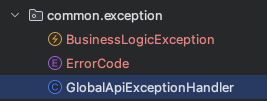
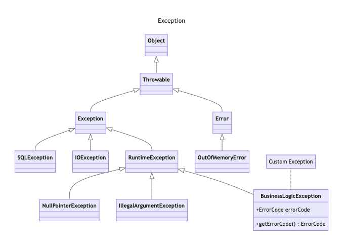

# Scenarios

If the user doesn't exist, try throwing an exception instead of nulling the Controller.

```java
@GetMapping(value = "/{id}")
public ResponseEntity<UserDTO> getDetail(@PathVariable final Long id) {
    final UserDTO user = userService.getDetail(id);

    // Change this part of the service to exception handling.
    if (user == null) {
        return ResponseEntity.notFound().build();
    } else {
        return ResponseEntity.ok(user);
    }
}

```

## 1. Create an Exception



### Error Message Definition (ErrorCode.java)

```java
@Getter
public enum ErrorCode {
    // errorCode, errorMessage, httpStatus to pass to user
    NOT_FOUND_USER(100, "not found user", HttpStatus.NOT_FOUND);

    private final Integer code;
    private final String message;
    private final HttpStatus httpStatus;

    ErrorCode(final Integer code,
              final String message,
              final HttpStatus httpStatus) {
        this.code = code;
        this.message = message;
        this.httpStatus = httpStatus;
    }
}
```

### Implementing a common CustomException (BusinessLogicException.java)
The exceptions that we will be working with in the service layer are those that occur during business logic processing.

Create a BusinessLogicException that inherits from RuntimeException because it is thrown while the application is running.
- Exception UML


```java
@Getter
public class BusinessLogicException extends RuntimeException {
    // Define the ErrorCode to expose to the user Enum
    final ErrorCode errorCode;

    public BusinessLogicException(final ErrorCode errorCode) {
        this.errorCode = errorCode;
    }
}

```

## 2. Change only the Service and Controller for exception handling
### 1. create UserNotFoundException in service

```java
@Transactional
public class UserServiceImpl implements UserService {

    private static class UserNotFoundException extends BusinessLogicException {
        public UserNotFoundException() {
            super(ErrorCode.NOT_FOUND_USER);
        }
    }
}
```

### 2. If no user is found, throw UserNotFoundException

- AS-IS

UserController.java
```java
@GetMapping(value = "/{id}")
public ResponseEntity<UserDTO> getDetail(@PathVariable final Long id) {
    final UserDTO user = userService.getDetail(id);

    // This is the part to change
    if (user == null) {
        return ResponseEntity.notFound().build();
    } else {
        return ResponseEntity.ok(user);
    }
}
```
UserServiceImpl.java
```java 
@Override
public UserDTO getDetail(Long id) {
    // Returning null if not present 
    return userRepository.findById(id)
            .map(UserDTO::new)
            .orElse(null);
}
```

- TO-BE

UserController.java
```java
@GetMapping(value = "/{id}")
public ResponseEntity<UserDTO> getDetail(@PathVariable final Long id) {
    final UserDTO user = userService.getDetail(id);

    return ResponseEntity.ok(user);
}
```
UserServiceImpl.java
```java 
@Override
public UserDTO getDetail(Long id) {
    return userRepository.findById(id)
            .map(UserDTO::new)
            .orElseThrow(UserNotFoundException::new);
}
```

- Execute

InternalServerError (HttpStatus: 500) on API execution
```
GET http://localhost:8080/api/v1/users/99
Content-Type: application/json

- Response
HTTP/1.1 500 
Content-Type: application/json
Transfer-Encoding: chunked
Date: Wed, 25 Sep 2024 06:35:31 GMT
Connection: close

{
  "timestamp": "2024-09-25T06:35:31.404+00:00",
  "status": 500,
  "error": "Internal Server Error",
  "path": "/api/v1/users/99"
}
```

### 3. Responding to the user with an error message definition (ErrorCode.java)
#### @RestControllerAdvice로 예외 처리 해보기

- Add 
```java 
@RestControllerAdvice
public class GlobalApiExceptionHandler {

    // If a BusinessLogicException object is thrown 
    @ExceptionHandler(BusinessLogicException.class)
    public ResponseEntity<ErrorResponse> BusinessLogicException(final BusinessLogicException ex) {
        final ErrorCode errorCode = ex.getErrorCode();

        return ResponseEntity.status(errorCode.getHttpStatus()).body(new ErrorResponse(errorCode));
    }
} 
```

- Execution

Receive an error message response when running the API (HttpStatus: 404)
```
GET http://localhost:8080/api/v1/users/99
Content-Type: application/json

- Response
HTTP/1.1 500 
Content-Type: application/json
Transfer-Encoding: chunked
Date: Wed, 25 Sep 2024 06:35:31 GMT
Connection: close

{
  "errorCode": 100,
  "message": "not found user"
}
```