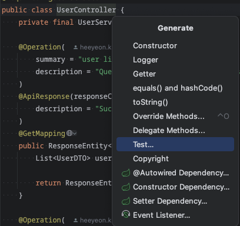
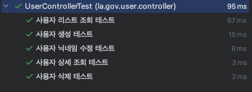

# Scenarios

## Write test code

```Gruby
dependencies {
    testImplementation 'org.springframework.boot:spring-boot-starter-test'
    testRuntimeOnly 'org.junit.platform:junit-platform-launcher'
}
```
### Testing MVC

User Controller > Create > Test... Select



Write the MVC call test

[UserControllerTest.java](src/test/java/la/gov/user/controller/UserControllerTest.java)

- Execution result
  


### Service Layer Test

UserServiceImpl > Create > Test... Select

Write the service layer test

[UserServiceTest.java](src/test/java/la/gov/user/service/UserServiceTest.java)

#### Writing Guide
``` Java
public class UserServiceTest {
    // Declare the userRepository object injected into the Service as a Mock object.
    @Mock
    private UserRepository userRepository;

    // Inject the service bean.
    // Service object to be tested 
    @InjectMocks
    private UserServiceImpl userService;

    @BeforeEach
    public void setUp() {
        MockitoAnnotations.openMocks(this);
    }
}
````

### Testing the repository layer (JPA component)

User Repository > Create > Test... Select.

[UserRepositoryTest.java](src/test/java/la/gov/user/repository/UserRepositoryTest.java)

Guide to writing ####
```java
@DataJpaTest
User repository test class {
    // JpaRepository implementor Bean Inject(Autowired)
    @Autowired
    private UserRepository userRepository;
}
```